# chat-electron-react
一个使用socket.io和Electron实现的实时聊天应用


# server部署说明:
  * 安装Redis
  * 安装MySql
  * 下载Minio: (https://min.io/) 官网有使用说明
  * 修改common/sendVerificationCode.ts:
  ```
  const transporter = nodeMailer.createTransport({
    host: "smtp.qq.com", //邮件发送的域名，我们这里使用的是QQ的服务
    port: 587,    // SMTP端口号
    secure: false,   //secure:true for port 465, secure:false for port 587
    auth: {
        user: fromMailer,  //邮件发送方的邮箱
        pass: ""   //开启POP服务生成的授权码,添加你的授权码
    }
})
```
* 如果你的Redis有设置账号密码就到common/redis.ts 添加你的账号密码
* ormconfig.json是MySql的配置文件,在此文件中修改数据库的信息
* 如果你的minio对象存储服务器不是使用默认的端口和账号密码需要修改minio/minio.ts
* 启动服务: npm run dev 或 yarn dev

- - -
# client启动说明:
 * 项目使用了ffi-napi,它需要编译c代码,所以需要安装:
    * npm i -g node-gyp
    * npm i -g --production windows-build-tools(需要管理员权限) 
 * 启动客户端:npm run start 或 yarn start
  
# 实现的功能:
 * 私聊
 * 群聊
 * 发送表情(字符表情)
 * 发送文件,下载文件
 * 音乐播放器
 * 视频播放器
 * 发送语音
 * 语音聊天,视频聊天(效果很不完美,技术有限解决不了)(webRtc实现)
 * 截图(截取屏幕是通过调用golang编写的dll实现,截图编辑使用了fabric.js)  

#项目演示图片:
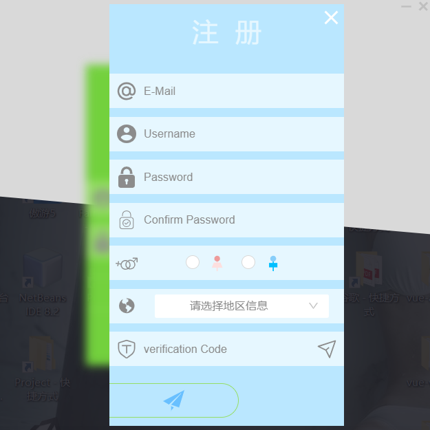

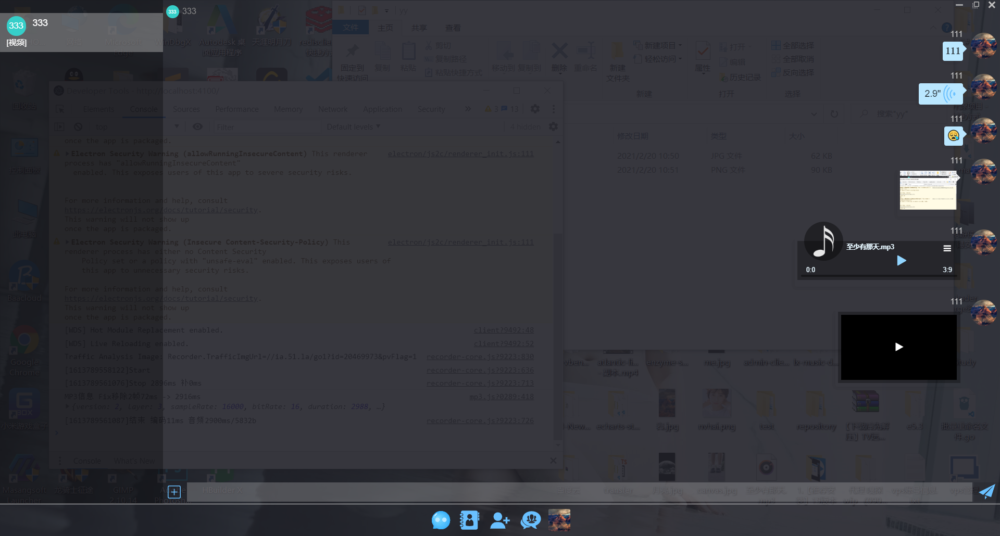
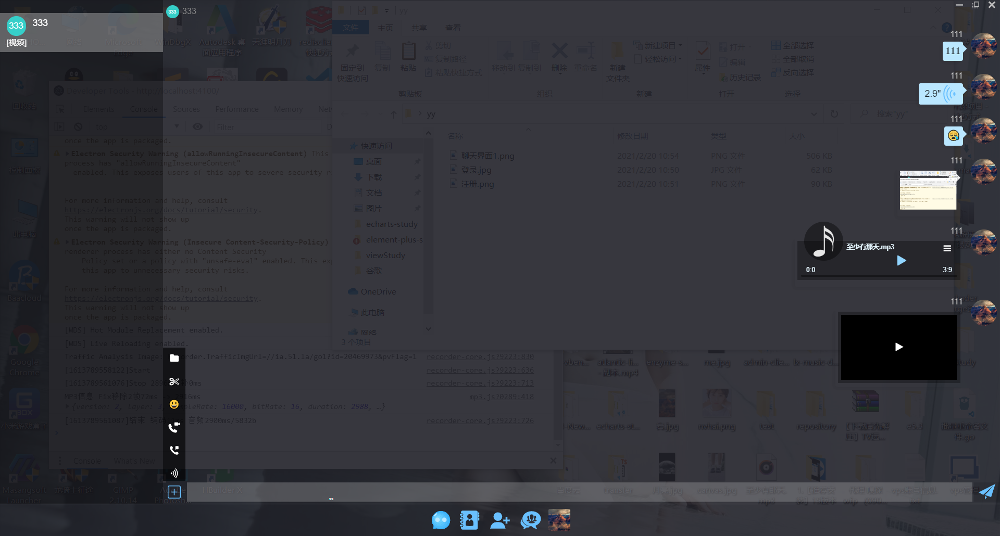
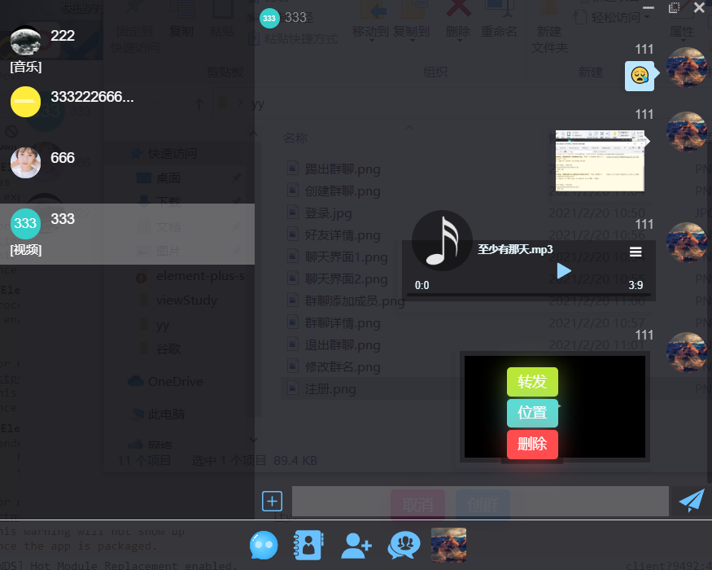
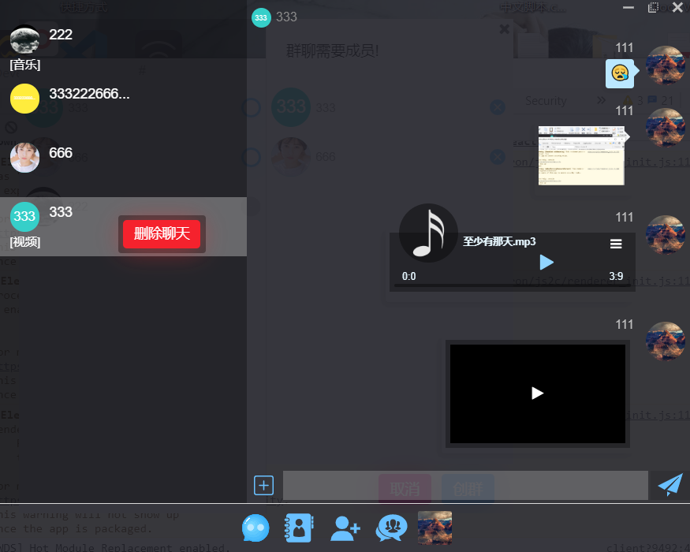
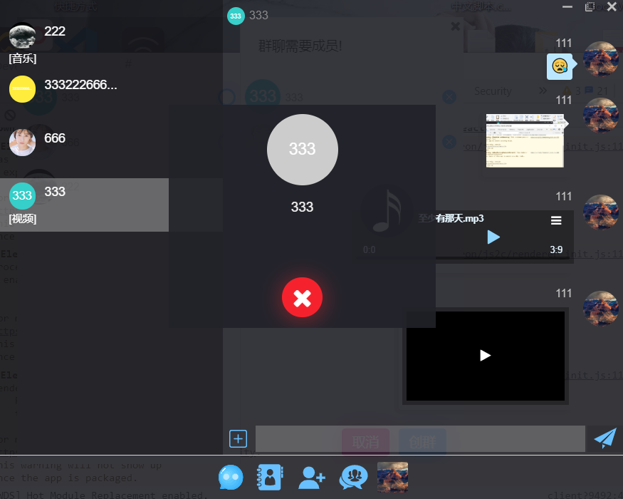
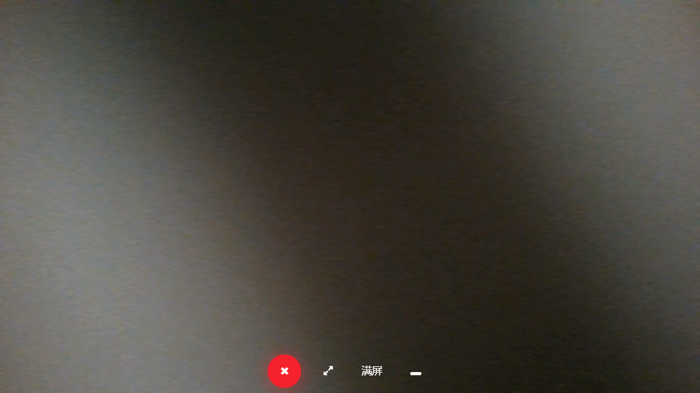
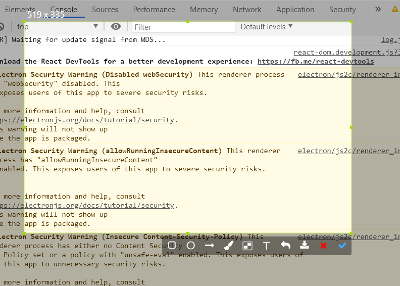
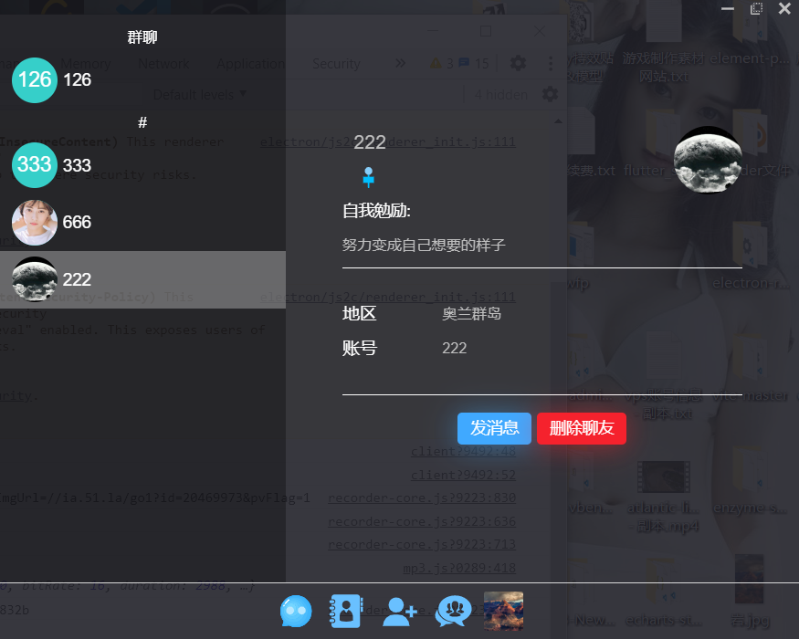
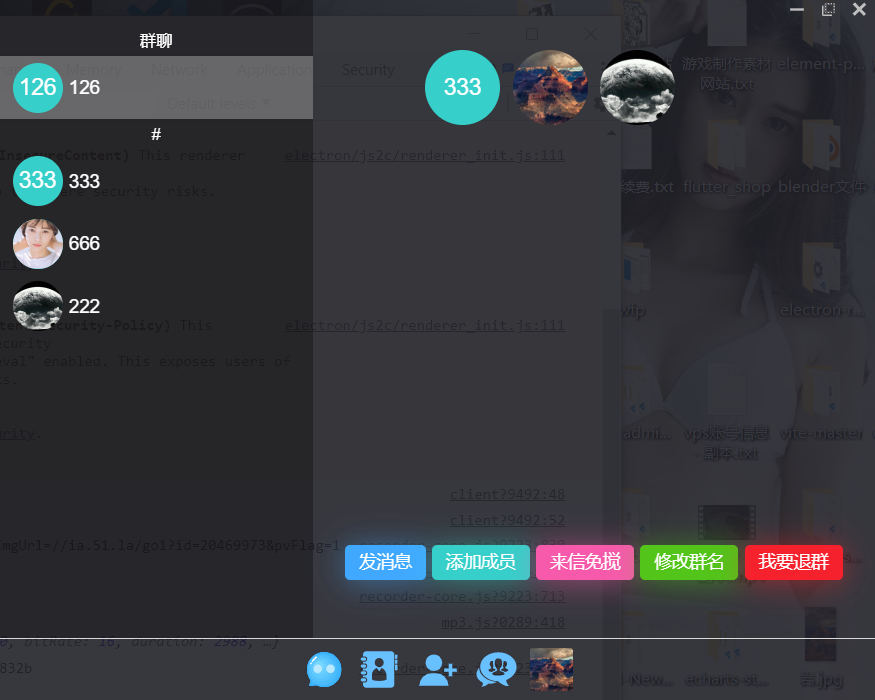
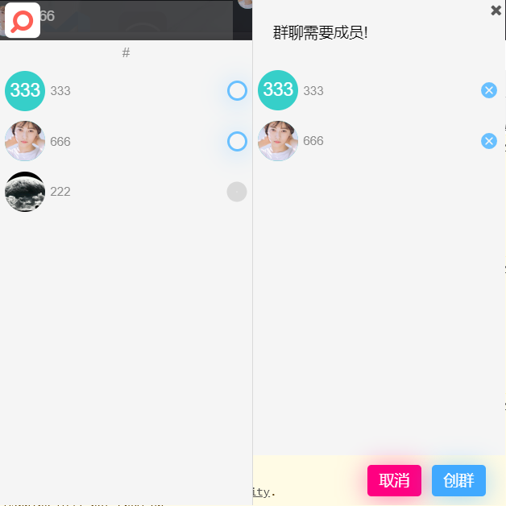
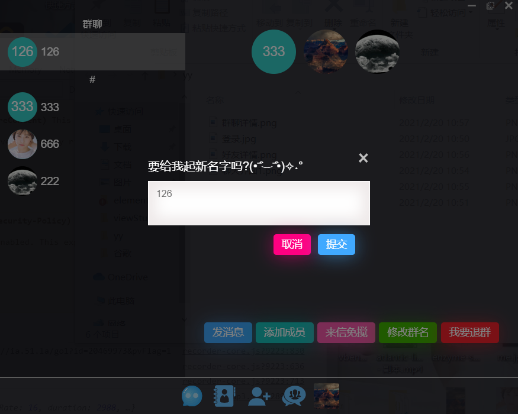
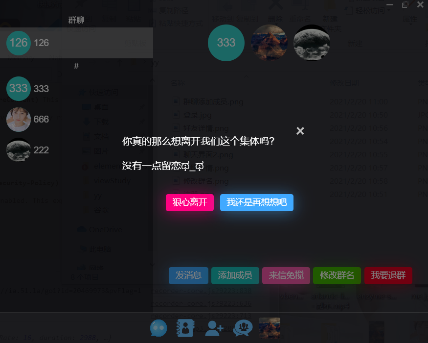
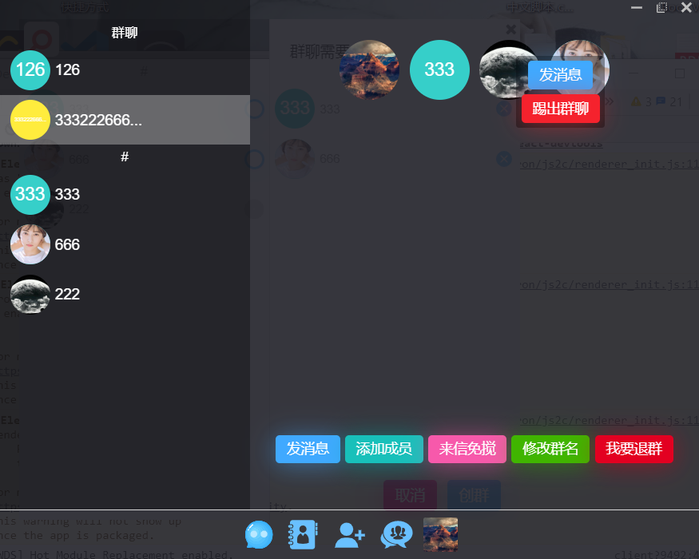
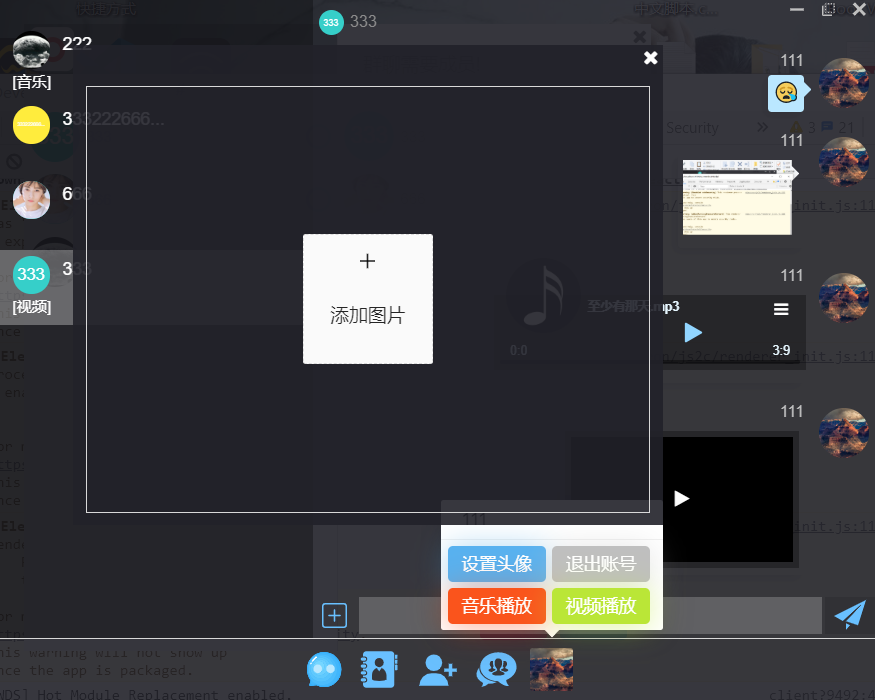
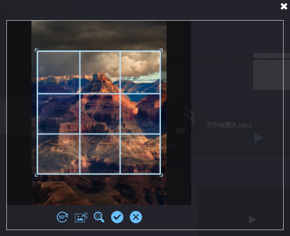
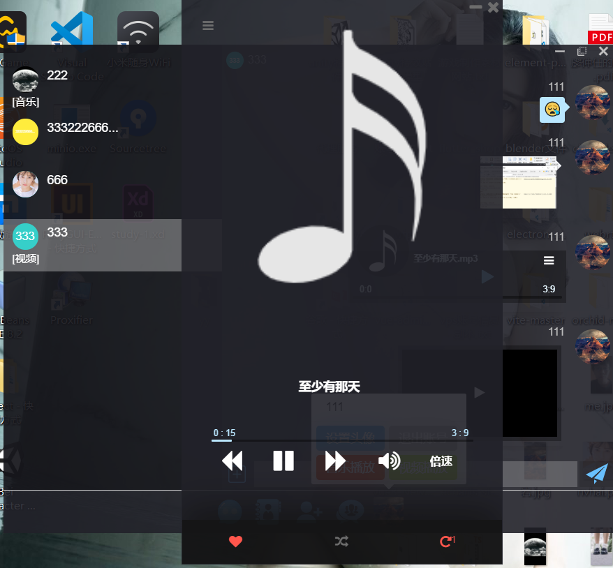
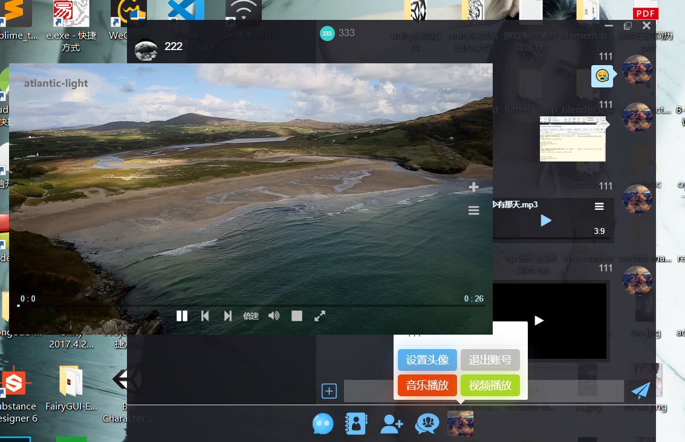
  
 # 代码并不完美,请多见谅
